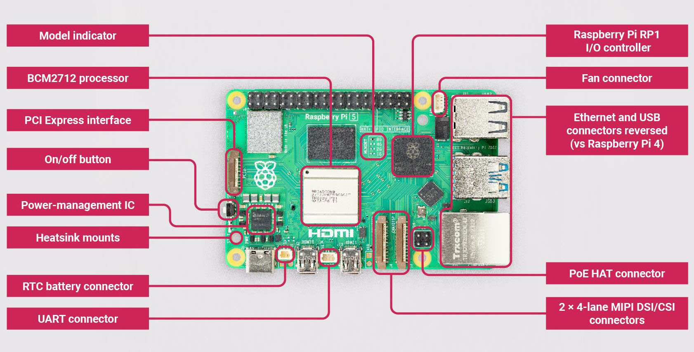

# 라즈베리 파이

이 저장소는 라즈베리 파이 활용을 위한 프로젝트입니다.

## 목차
- [소개](#라즈베리-파이란?)
- [비교](#아두이노와-비교)
- [라즈베리 파이 5 구조](#라즈베리-파이-5-구조)

   

## 라즈베리 파이(Raspberry Pi)란?
라즈베리 파이(Raspberry Pi)는 손바닥만 한 크기의 저가형 소형 컴퓨터로, 주로 코딩 학습과 다양한 전자 프로젝트에 활용. 리눅스 기반 운영체제를 사용하며, HDMI, USB, Wi-Fi, GPIO(입출력 핀) 등 다양한 연결 기능을 갖추고 있어 키보드, 모니터를 연결하면 일반 컴퓨터처럼 사용 가능. Python 또는 C 언어 등으로 프로그래밍 할 수 있으며, 센서나 모터를 연결해 사물인터넷(Internet of Things, IoT), 로봇 제어, 얼굴 인식 같은 프로젝트도 가능. 성능은 스마트폰보다 낮지만, 교육용이나 창의적인 메이커 활동에 매우 적합.

   

## 아두이노(Arduino)와 비교
| 항목 | 라즈베리 파이 | 아두이노 |
|-----|-----|-----|
| 종류            | 소형 컴퓨터           | 마이크로 컨트롤러 |
| 운영체제        | Linux 기반 OS         | 없음              |
| 프로그래밍 언어 | Python, C/C++ 등      | C/C++             |
| 멀티태스킹      | 가능                  | 불가능(단일 루프) |
| 구성요소        | CPU, RAM(고), 저장장치(SD 등), I/O | CPU, RAM(소), Flash 드라이브|
| 메모리          | MB ~ GB| KB ~ MB |
| 주목적          | 범용 컴퓨팅, 영상 출력, 인터넷 연결, 데이터 처리  |  센서/모터 제어, 단순 반복 제어 | 
| 사용 예시        | 미디어 재생, 웹서버, 얼굴 인식 처리 | 전등 자동 제어, 온도 감지 후 팬 켜기 |
| 전원 ON 시 동작 | OS 부팅 -> 로그인 -> 프로그램 실행 | 프로그램 실행 |

   

## 왜 라즈베리 파이를 마이크로 컨트롤러라고 부르면 안될까?
마이크로 컨트롤러는 단순 제어에 특화된 "제어 전용칩" 인 반면에 라즈베리 파이는 CPU, RAM, 저장 장치등 여러 부품이 결합된 소형 컴퓨터.

   

## 컴퓨터의 필수 구성요소
| 구성요소 | 설명 |
|-----|-----|
| CPU | 명령을 처리하고 연산 수행(중앙처리장치) |
| RAM | 프로그램 실행 중 데이터를 저장하고 읽어오는 임시 기억 장치 |
| 저장장치 | 운영체제 및 프로그램 저장 (비휘발성 메모리) (예: ROM, SSD, HDD, SD 등) |
| 입출력 장치 | 사용자의 명령을 받고 결과를 출력하는 수단 (예: 키보드, 모니터 등) |
 - 운영체제(OS)는 소프트웨어지만, 현대 컴퓨터가 실용적으로 동작하려면 필수. 특수 목적의 경우 OS 없이 부트 가능(임베디드 부트로더)
 - 마더보드, 전원공급장치 등은 필수이나, 구현 방식 또는 하드웨어 인프라에 가깝기에 논외

   

## 마이크로컨트롤러의  필수 구성요소
 - '한 칩에서 컴퓨터처럼 동작하도록 만든 장치'이므로, 한 개의 칩에 다음 요소들이 반드시 포함되어야 함

| 구성요소 | 설명 |
|-----|-----|
| CPU | 연산 및 명령 실행|
| RAM | 실행 중인 작업에 필요한 임시 데이터 저장 |
| Flash ROM(또는 EEPROM) | 프로그램 코드 저장 (전원 꺼져도 유지) |
| I/O핀 | 외부 장치와 신호 주고 받음(디지털/아날로그 신호) |
 - 타이머, ADC, UART, SPI, I2C와 같은 요소는 필수 아님. 하지만 대부분 내장. 

   

## 라즈베리 파이 5 구조

참고: https://www.kiwi-electronics.com/en/raspberry-pi-5-16gb-20255

   

## 라즈베리파이 이미저(Raspberry Pi Imager) 
운영체제 이미지를 SD카드 또는 USB로 플래싱해주는 프로그램. 라즈베리파이는 운영체제로 '라즈베리파이 OS(Raspberry Pi OS)' 사용. 우분투(Ubuntu), 리트로파이(RetroPie) 등도 목적에 따라 사용

- '플래싱'이란, 운영체제 이미지 파일을 SD카드나 USB에 그냥 복사하는 게 아니라, 그 저장장치가 "운영체제 부팅이 가능한 상태"가 되도록 통째로 덮어써 주는 작업
- '이미지'란, 운영체제가 설치된 저장장치 전체를 복사한 파일(.img 확장자)
- 링크: [v1.8.5](https://github.com/raspberrypi/rpi-imager/releases/tag/v1.8.5)

   

## 

   

## 시작하기
- [시작 가이드](./getting-started.md)
- [사용 방법](./usage.md)
